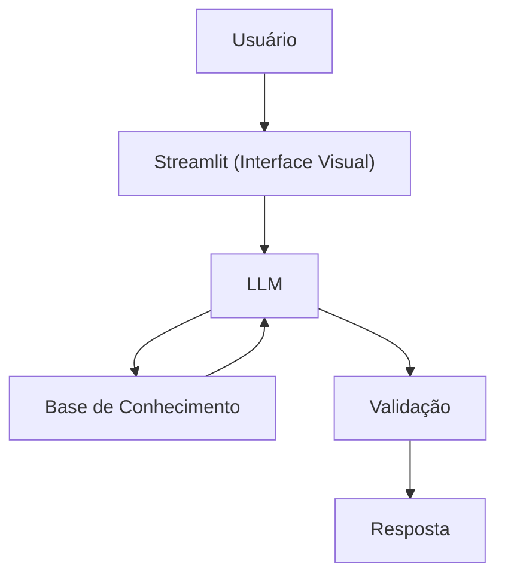

# Finon - Educador Financeiro Inteligente

> Agente de IA proativo para educação e planejamento financeiro pessoal

## Sobre o Projeto

**Finon** é um agente financeiro inteligente desenvolvido com IA Generativa, focado em democratizar a educação financeira através de uma experiência personalizada, consultiva e segura. Diferente de chatbots convencionais, Finon atua de forma proativa, antecipando necessidades e co-criando soluções financeiras junto ao usuário.

### Problema Resolvido

Muitas pessoas têm dificuldade em gerenciar suas finanças pessoais por falta de conhecimento ou orientação adequada. Finon oferece:

- **Educação financeira personalizada** adaptada ao perfil do usuário
- **Análise inteligente** de transações e padrões de gastos
- **Recomendações proativas** baseadas no histórico e objetivos
- **Consultoria acessível** disponível 24/7

## Funcionalidades

- Análise de perfil de investidor e comportamento financeiro
- Recomendações personalizadas de produtos financeiros
- Alertas inteligentes sobre gastos e oportunidades
- Educação financeira contextualizada
- Prevenção de alucinações com validação de dados
- Integração com histórico de transações e atendimentos

## Arquitetura do Projeto



## Estrutura do Projeto

O projeto está estruturado seguindo as melhores práticas de desenvolvimento de agentes de IA:

```
dio-lab-bia-do-futuro/
├── 📁 data/              # Base de conhecimento (CSVs e JSONs)
├── 📁 docs/              # Documentação completa do agente
├── 📁 src/               # Código-fonte da aplicação
├── 📁 assets/            # Recursos visuais
└── 📁 examples/          # Exemplos de implementação
```

## 📚 Documentação

A documentação completa do projeto está disponível na pasta [`/docs`](./docs):

1. **[Documentação do Agente](./docs/01-documentacao-agente.md)** - Caso de uso, persona e arquitetura
2. **[Base de Conhecimento](./docs/02-base-conhecimento.md)** - Estrutura e estratégia de dados
3. **[Engenharia de Prompts](./docs/03-prompts.md)** - System prompts e exemplos
4. **[Métricas e Avaliação](./docs/04-metricas.md)** - KPIs e testes de qualidade
5. **[Pitch do Projeto](./docs/05-pitch.md)** - Apresentação executiva

## 💾 Base de Conhecimento

Finon utiliza dados estruturados para garantir respostas precisas:

| Arquivo | Descrição |
|---------|-----------|
| `transacoes.csv` | Histórico de transações do usuário |
| `historico_atendimento.csv` | Interações anteriores |
| `perfil_investidor.json` | Perfil e preferências |
| `produtos_financeiros.json` | Catálogo de produtos |

## 🛠️ Tecnologias Utilizadas

- **LLM**: Ollama para processamento de linguagem natural
- **Interface**: Streamlit para interface web
- **Dados**: JSON/CSV mockados

## 🚀 Como Executar

Faça a instalação do Ollama e do gpt-oss

```bash
# Clone o repositório
git clone https://github.com/matheus-rmds/dio-lab-bia-do-futuro.git

# Acesse o diretório
cd dio-lab-bia-do-futuro

# Instale as dependências
pip install streamlit pandas requests

# Execute a aplicação
streamlit run src/app.py
```

## 🎨 Diferenciais do Finon

- **Proatividade**: Antecipa necessidades baseado em padrões
- **Personalização**: Adapta-se ao perfil e contexto do usuário  
- **Segurança**: Validação rigorosa para evitar informações incorretas
- **Educação**: Foco em ensinar, não apenas informar
- **Acessibilidade**: Linguagem clara e inclusiva

## 📊 Métricas de Qualidade

- Taxa de precisão nas recomendações
- Índice de satisfação do usuário
- Tempo médio de resolução de dúvidas
- Taxa de respostas validadas (sem alucinações)
